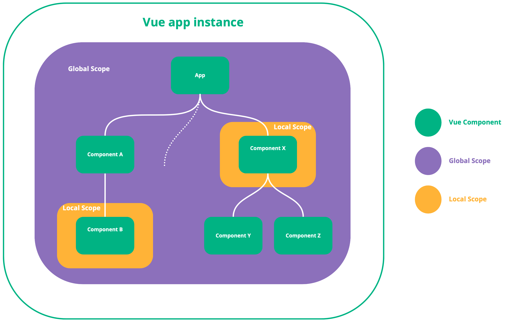

# 基础

## 消息格式语法

Vue-il8n 使用 `{}` 占位符号进行插值

### 命名插值

通过 `key` 进行匹配

```js
// 语言定义
const messages = {
    'zh': {
        hello: `{ msg } world`, //  { msg } 定义 msg 占位符
    }
}

// 模板使用
<p>{{ $t('hello', { msg: 'hello' }) }}</p>

// 显示结果
<p>hello world</p>
```

### 列表插值

通过下标索引进行匹配

```js
// 语言定义
const messages = {
    'zh': {
        hello: `{ 0 } world`, //  { msg } 定义 msg 占位符
    }
}

// 模板使用
<p>{{ $t('message.hello', [ 'hello' ]) }}</p>

// 显示结果
<p>hello world</p>
```

### 文本插值

使用单引号引起来的字符，属于字面量，不会进行转换

```js
// 语言定义
const messages = {
    'zh': {
        address: `{ account }{ '@' }{ domain }`,
    }
}

// 模板使用
<p>email: {{ $t('address', { account: 'foo', domain: 'domain.com' }) }}</p>

// 显示结果
<p>email: foo@domain.com</p>
```

### 复用现有语言消息

通过 `@:key` 的语言进行引用

```js
// 语言定义
const messages = {
    'zh': {
        hello: 'Hello',
        world: "World",
        info: `@:hello @:world !!!`
    }
}

// 模板使用
<p>Info: {{ $t('info') }}</p>

// 显示结果
<p>Info: Hello World !!!</p>
```

:::warning
当引用含有插值的消息，列表插值语法和命名插值语法不能同时使用
:::

### 内置修饰符

通过 `@.modifier:key` 语法进行引用，以下是内置修饰符:

- `upper` 转换为大写
- `lower` 转换为小写
- `capitalize` 转换第一个字符大写

```js
// 语言定义
const messages = {
    'zh': {
        hello: 'Hello',
        info: '@.upper:hello'
    }
}

// 模板使用
<p>{{ $t('info') }}</p>

// 显示结果
<p>HELLO</p>
```

### 自定义修饰符

在 `createIl8n` 中指定 `modifiers`

```js
const il8n = createI18n({
    locale: 'zh',
    messages: { ... }
    modifiers: {
        // str: string | VNode
        snakeCase: (str) => {
            if (typeof str === 'string') {
                return str.split(' ').join('_')
            } else {
                return str
            }
        }
    }
})

// 语言定义
const messages = {
    'zh': {
        snake: 'snake case',
        info: `@.snakeCase:snake` // 也支持 @.snakeCase:{ 'snake' } 语法
    }
}

// 模板使用
<p>{{ $t('info') }}</p>

// 显示结果
<p>snake_case</p>
```

### 特殊字符

因为插值语法的缘故，使用以下特殊字符时应使用文本插值的方式进行使用

- `{`
- `}`
- `@`
- `$`
- `|`

### HTML 字符

支持包含 HTML 的消息, [参考示例](https://vue-i18n.intlify.dev/guide/essentials/syntax.html#html-message)

## 多元化 (暂时未搞懂应用场景)

支持消息的复数形式，以 `|` 分隔，使用 `$tc(key, index, { key: value }?)` 取值

```js
// 语言定义
const messages = {
    'zh': {
        car: 'car | cars',
        apple: 'no apples | one apple | { count } apples'
    }
}

// 模板使用
<p>{{ $tc('car', 1) }}</p>
<p>{{ $tc('car', 2) }}</p>
<p>{{ $tc('apple', 0) }}</p>
<p>{{ $tc('apple', 1) }}</p>
<p>{{ $tc('apple', 10) }}</p>
<p>{{ $tc('apple', 10, { count: 10 }) }}</p> // 可以使用命名参数覆盖

// 显示结果
<p>car</p>
<p>cars</p>
<p>no apples</p>
<p>one apple</p>
<p>10 apple</p>
<p>10 apple</p>
```

## 日期时间格式

定义格式本地化日期时间，使用 `$d` 本地化 `DateTime` 的值

## 数字格式

定义格式本地化数字，使用 `$n` 本地化 `Number` 的值

## 语言范围 & 语言切换

### 语言消息作用范围

> Vue I18n 管理资源以提供 i18n 功能，包括语言环境切换、称为语言环境消息的每种语言消息以及日期时间和数字的命名格式。它们由VueI18n实例管理。

Vue I18n 有以下两个范围：

- 全局范围
    - 全局范围允许访问所有消息，如果想要集中管理则非常有用
    - 全局范围是在 `createIl8n` 时进行创建，可通过 `il8n` 实例的 `global` 属性访问
    - `il8n` 未指定组件选项时，默认访问全局范围，组件上启用全局范围，访问的也是全局范围
- 本地区域范围
    - 本地范围允许每个组件的基础上应用范围，组件消息隔离。
    - 启动本地范围 `il8n`, 会在组件初始化时创建一个 `VueIl8n` 实例, 因此组件中的 `il8n` 与 全局的 `il8n` 实例不同



### 语言区域切换

通过 `createIl8n` 创建的实例 `il8n` 的 `locale` 属性进行设置更改

:::tip
组件本地化区域默认继承全局范围更改，如不想被修改，可通过组件选项 `sync` 值改为 `false`
:::

```js
// main.ts
const i18n = createI18n({
    locale  : 'zh',
    messages: {
        'zh': {
            hello: '你好!',
        },
        "en-us": {
            hello: 'hello!'
        }
    },
})

createApp({
    // ...
}).use(i18n).mount('#app')
```

模板：

```html
<template>
    <div class="locale-changer">
        <select v-model="$i18n.locale">
            <!-- availableLocales 存储着所有区域 -->
            <option v-for="locale in $i18n.availableLocales" :key="`locale-${locale}`" :value="locale">
                {{ locale }}
            </option>
        </select>
    </div>
</template>
```

### 本地范围的本地化

示例：

```js
import { createApp  } from 'vue'
import { createI18n } from 'vue-i18n'

const i18n = createI18n({
    locale  : 'zh',
    messages: {
        zh: {
            info: '你好 世界',
        },
        en: {
            info: 'hello world',
        }
    }
})

const Child = {
    template: `
        <div>{{ $t('info') }}</div>
    `,
    il8n: {
        messages: {
            'zh': {
                info: '我是子组件'
            },
            'en-us': {
                info: 'I am child component'
            }
        }
    }
}

createApp({
    components: { Child }
}).use(il8n).mount('#app')
```

模板：

```html
<div id="app">
    <h1>Root</h1>
    <p>{{ $t('info') }}</p>
    <Child />
</div>
```

## 回退

fallbackLocale: '&lt;lang&gt;' 当首选语言没有翻译时，选择要使用的语言。

### 语言环境的隐式回退

如果 `locale` 含有国家和可选的方言，则会自动激活隐式回退

例如 `de-DE-bavarian` 会回退：

- `de-DE-bavarian`
- `de-DE`
- `de`

要抑制自动回退，请添加后缀感叹号!，例如 `de-DE!`

### 指定语言环境的显示回退

在创建 `createIl8n` 的 `fallbackLocale` 显示指定

- 一种语言的显示回退

    ```js
    fallbackLocale: 'zh'
    ```
- 多个语言的显示回退
    ```js
    fallbackLocale: ['zh-hk', 'zh-en']
    ```
- 对象形式的显示回退
    ```js
    fallbackLocale: {
        'zh-tw'  : ['zh-hk'],    // => zh-tw > zh-hk > zh > zh
        'default': ['zh', 'zh']
    }
    ```

### 回退插值

如果翻译的键就是显示的字符串，可以结合 `formatFallbackMessages: true` 仅键进行翻译模板插值

```js
// 如下，如果回退语言是 en 的话，则键就是显示字符串
// 则不必为 `Hello, World` 字符串翻译成英文
const message = {
    'zh': {
        'Hello, World': '你好，世界'
        'Hello, { name }': '你好，{ name }'
    }
}
```

:::warning
如果键含有模板插值，则需要开启 `formatFallbackMessages: true`，未开启时则仅展示回退语言的键值
:::
