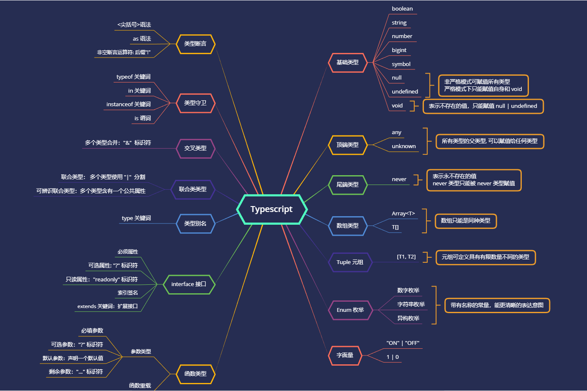

# 基础知识总结

## 为什么需要 Typescript

Javascript 是一门动态的脚本语言，意味着只有运行的时候才能发现程序的某些错误。
而 Typescript 提供了静态分析，就可以帮助我们在程序运行前的编码阶段就能发现某些错误。

## 功能概览

[Typescript 基础知识文档](https://www.typescriptlang.org/docs/handbook/2/everyday-types.html)

## 工具类型概览

[Typescript 工具类型文档](https://www.typescriptlang.org/docs/handbook/utility-types.html)

- `Awaited<Type>` 取得 Promise 返回值类型
- `Partial<Type>` 将给定类型的属性转换为可选属性
- `Required<Type>` 将给定类型的属性转换为必须属性
- `Readonly<Type>` 将给定类型的属性转换为只读属性
- `Record<Keys, Type>` 构造一个对象类型，其属性键为Keys，属性值为Type
- `Pick<Type, Keys>` 选取给定类型指定的 keys(字符串文字或字符串文字的并集) 来构造一个类型
- `Omit<Type, Keys>` 排除给定类型指定的 keys(字符串文字或字符串文字的并集) 来构造一个类型
- `Exclude<UnionType, ExcludedMembers>` 提取联合成员中无交集的成员构造一个类型
- `Extract<Type, Union>` 提取联合成员中有交集的成员构造一个类型
- `NonNullable<Type>` 排除不是 `null` 和 `undefined` 来构造一个类型
- `Parameters<Type>` 提取函数参数类型来构造一个元组类型
- `ConstructorParameters<Type>` 提取构造函数参数类型来构造一个元组类型
- `ReturnType<Type>` 提取函数返回类型来构造一个类型
- `InstanceType<Type>` 提取构造函数返回的实例类型构造一个类型
- `ThisParameterType<Type>` 提取函数的 `this` 参数类型, 无参数返回 `unknown`
- `OmitThisParameter<Type>` 删除函数的 `this` 参数类型
- `ThisType<Type>` 取得 `this` 类型
- 字符串操作类型
    - `Uppercase<StringType>` 将字符串的每个字符转换为大写
    - `Lowercase<StringType>` 将字符串的每个字符转换为小写
    - `Capitalize<StringType>` 将字符串的第一个字符转换为大写
    - `Uncapitalize<StringType>` 将字符串的第一个字母转换为小写

## 参考文章

- [Typescript 官网](https://www.typescriptlang.org/docs/handbook/2/basic-types.html)
- [Typescript 入门教程 - 阮一峰](https://ts.xcatliu.com/basics/type-inference.html)
- [2022 typescript史上最强学习入门文章(2w字)](https://juejin.cn/post/7018805943710253086#heading-11)
- [Ts高手篇：22个示例深入讲解Ts最晦涩难懂的高级类型工具](https://juejin.cn/post/6994102811218673700#heading-20)
