# 搭建 Ubuntu Server 环境

使用 Vmware 虚拟机搭建 Ubuntu Server 环境

## 相关资源

- [VMware Workstation Pro](https://pan.baidu.com/s/1Fsd26uhwUhPzmwGTKVT-cw) 网盘下载 (提取码：sqy8)

- [Ubuntu Server vmdk文件](https://www.osboxes.org/ubuntu-server/) 下载

    以前使用虚拟机安装 Ubuntu 是通过 ISO 安装系统的方式。
    现在可以直接使用 vmdk(虚拟机安装操作系统后生成的文件类型)，免去了安装的麻烦

    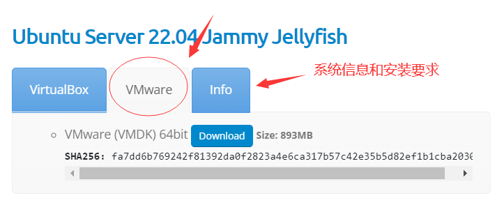

## 安装 Ubuntu Server

下载 `vmdk` 解压后，[VMware Workstation Pro](https://pan.baidu.com/s/1Fsd26uhwUhPzmwGTKVT-cw) 工具
是不支持直接打开 `vmdk`，需要先创建一个空白硬盘，然后使用下载的 `vmdk` 替换空白的 `vmdk`


1. 打开 [VMware Workstation Pro](https://pan.baidu.com/s/1Fsd26uhwUhPzmwGTKVT-cw) 软件，选择 “创建新的虚拟机”

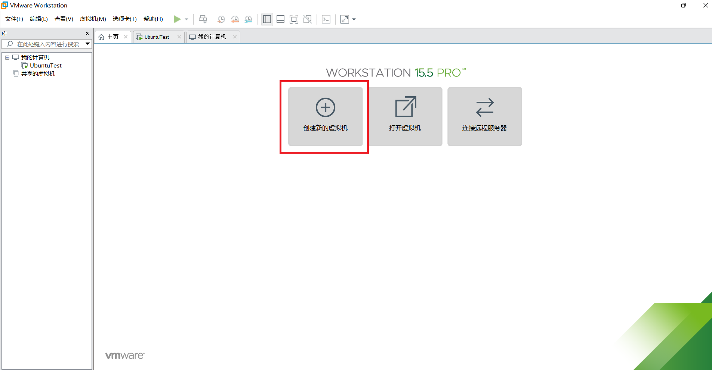

2. 新建虚拟机向导，使用 “典型(推荐)” 方式安装

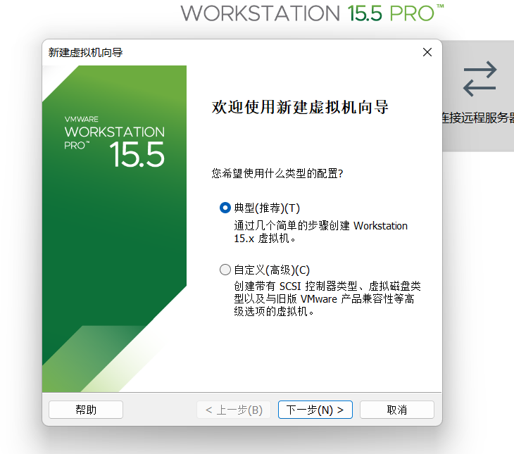

3. 创建一个空白硬盘，选择 “稍后安装操作系统”

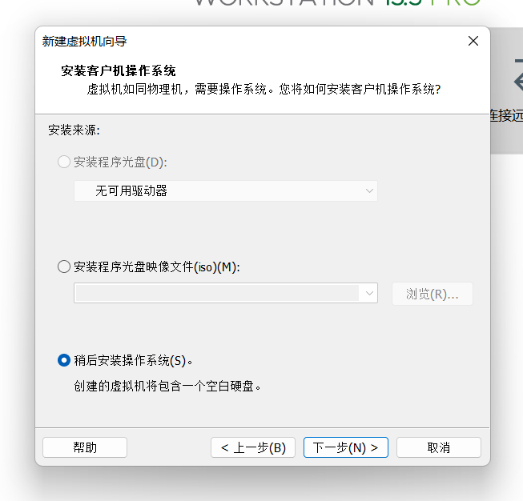

4. 选择操作系统 “Linux”

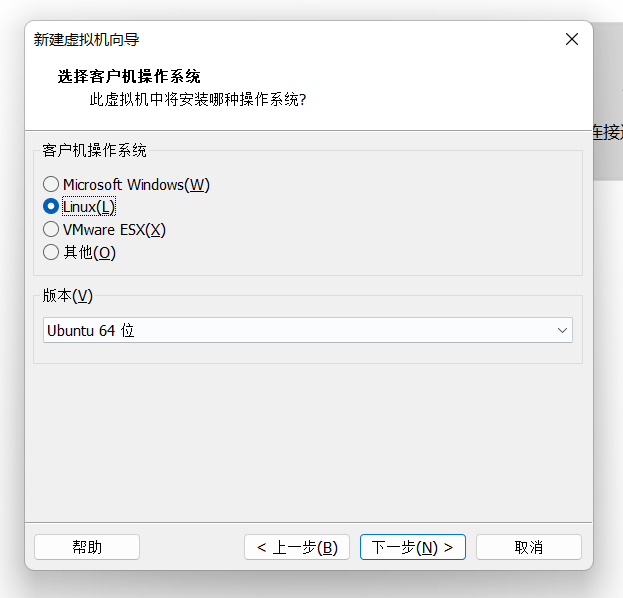

5. 命名虚拟机、且可自行选择虚拟机存储位置

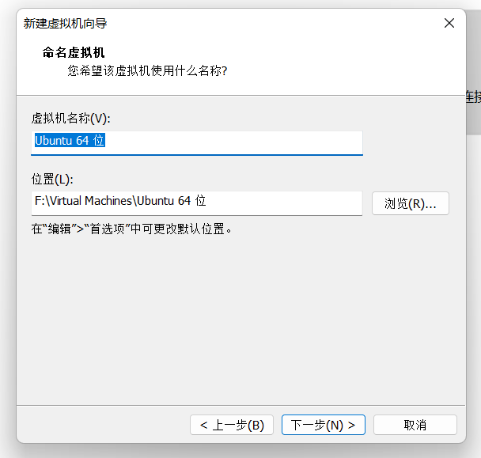

6. 指定磁盘容量，将虚拟磁盘存储为单个文件

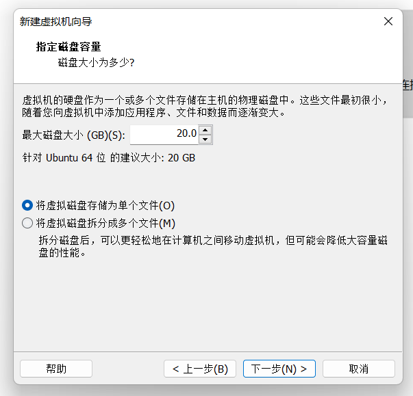

7. 完成创建

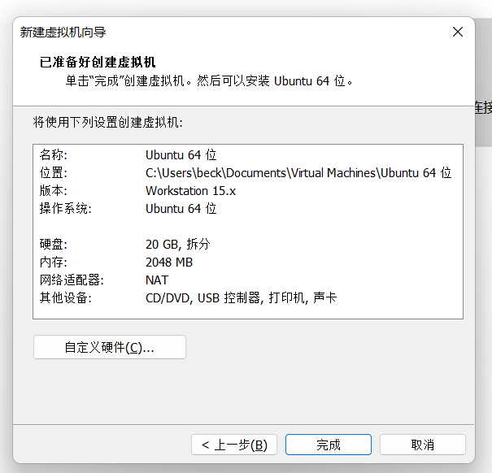

8. 选择创建好的虚拟机，进入设置界面

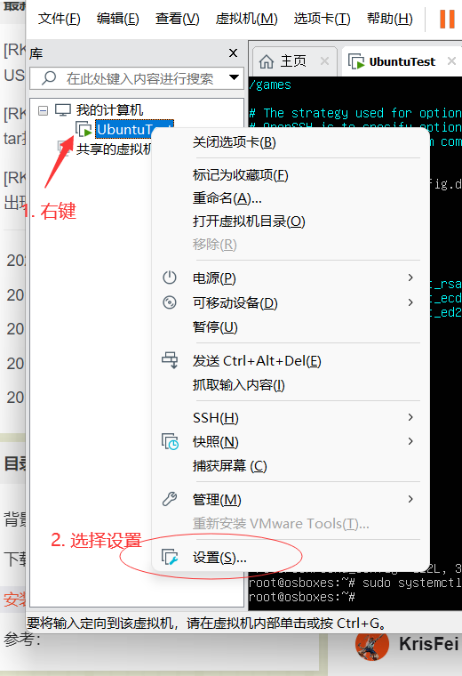

9. 选择 “硬盘”，点击 “移除”

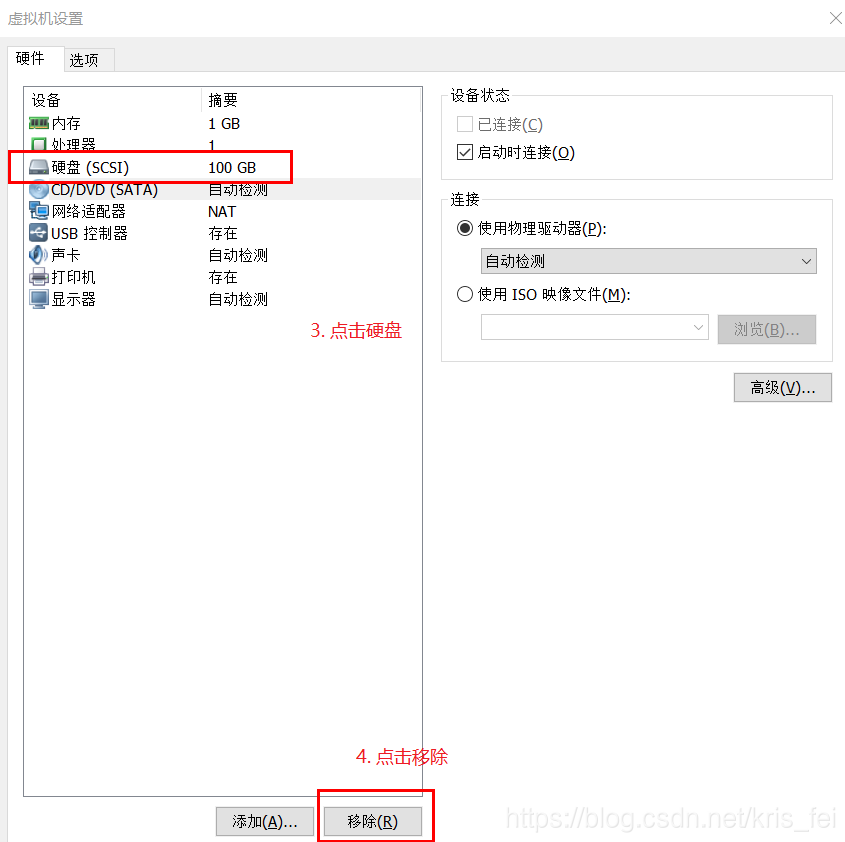

10. 点击 “添加”

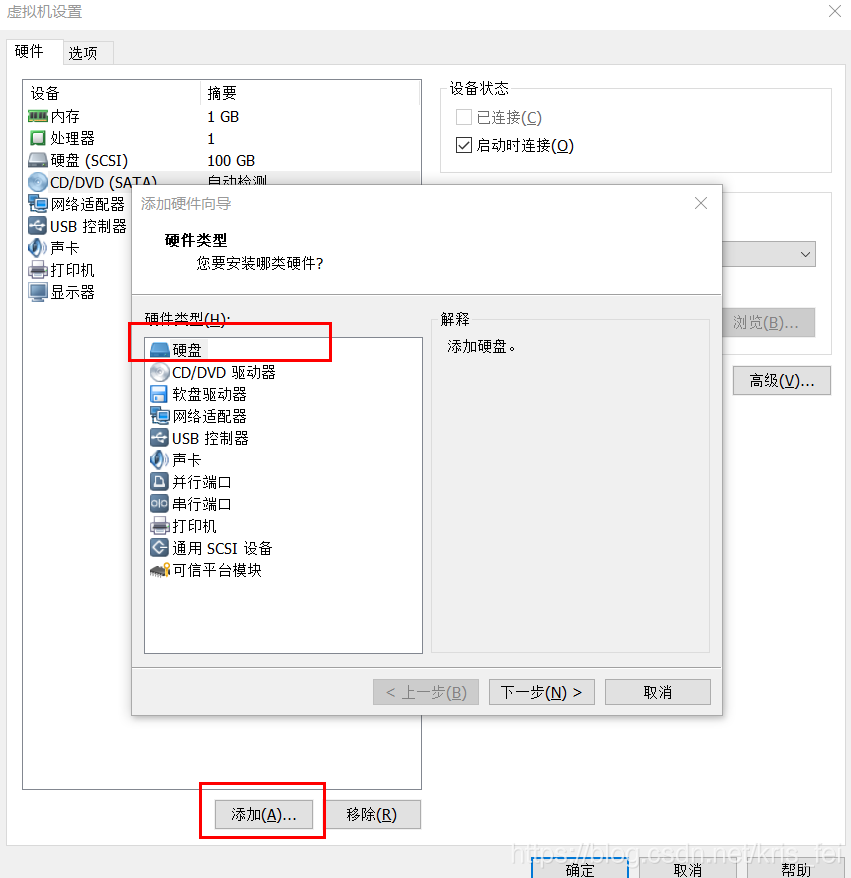

11. 选择 “SCSI” 磁盘类型

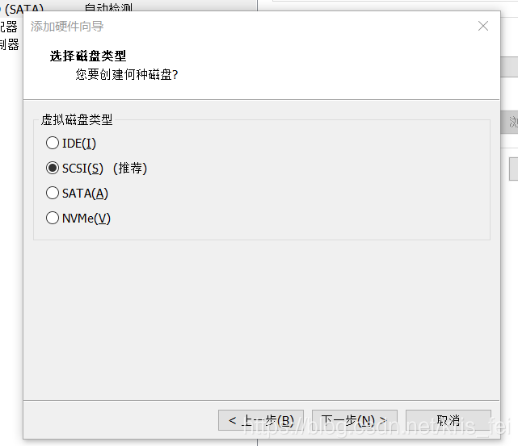

12. 选择 “使用现有虚拟磁盘”

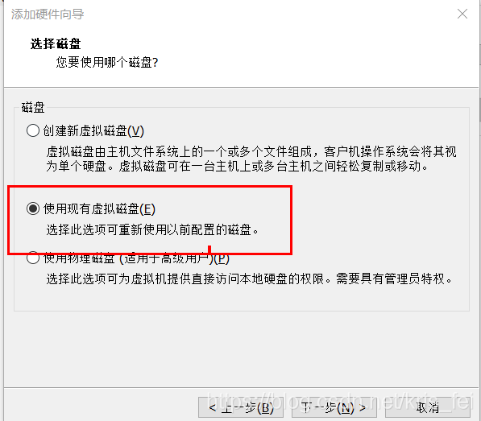

13. 选择下载好的 `vmdk`

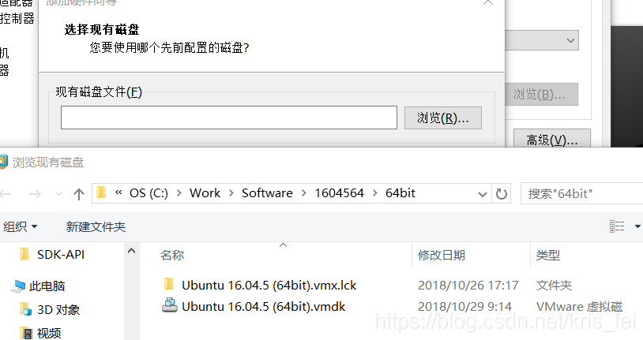

## 使用 root 用户
- `$` 是普通管理员
- `#` 是系统管理员

默认的 `root` 用户是没有固定密码的，每次开机都会产生一个新的 `root` 密码，如想使用 `root` 账号则必须设置 `root` 密码

1. 使用安装的用户登录
2. 执行 `sudo passwd root # 回车`
    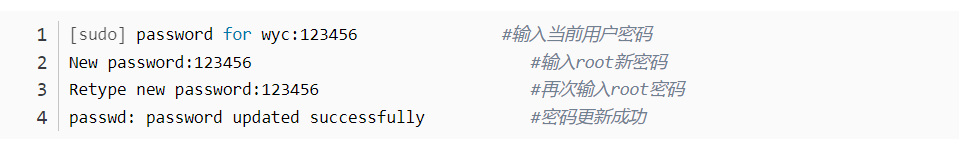
3. 设置完成后，执行 `su root` 便可切换至 `root` 用户

## 开启 root 可使用 ssh 登录

因为 `root` 权限太高，安全起见 Ubuntu 下 `SSH` 默认不允许使用 `root` 登录，可通过修改 `SSH` 配置文件允许 `root` 用户登录

1. 打开配置文件
    ```sh
    sudo vim /etc/ssh/sshd_config
    ```
2. 找到 `#PermitRootLogin prohibit-password'
    ```sh
    #PermitRootLogin prohibit-password

    # 去掉 “#” 注释，并修改值为 yes
    PermitRootLogin yes
    ```
3. 保存退出, 重启 sshd.service
    ```sh
    sudo systemctl restart sshd.service
    ```

## 配置 VScode 远程开发

1. 安装 Vscode 扩展

    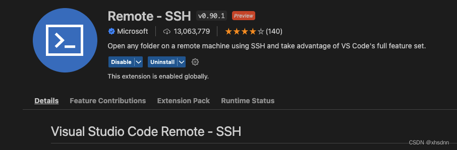

2. 修改用户下的 `.ssh/config` 文件，默认在用户目录下
    ```
    # 添加以下配置
    # ----------------------------------------------------
    Host UbuntuTest            # 主机别名，展示用便于区分
    HostName 服务器IP          # eg: 192.15.16.17
    User root                  # 登录用户
    IdentityFile ~/.ssh/id_rsa # 私钥文件路径
    ```
3. 将公钥内容拷贝至服务器 `.ssh/authorized_keys` 文件其中保存，便可以实现免密登录

## 参考文章

- [[Tools][Vmware] 如何直接使用vmdk而不是ISO](https://blog.csdn.net/kris_fei/article/details/83501098)
- [s【Linux】ubuntu系统root用户不能通过ssh连接](https://blog.csdn.net/jn10010537/article/details/126742998)
- [Ubuntu18.04设置root密码（初始密码）](https://blog.csdn.net/a6661314/article/details/124391440)
- [ubuntu修改root用户名,ubuntu查看用户名和密码](https://www.zhangshilong.cn/work/134734.html)
- [Ubuntu下root用户无法通过SSH登录？](https://blog.csdn.net/hgq522/article/details/121391813)
- [VSCode 的 Remote-SSH 免密登陆](https://blog.csdn.net/qq_26733915/article/details/127552273)
